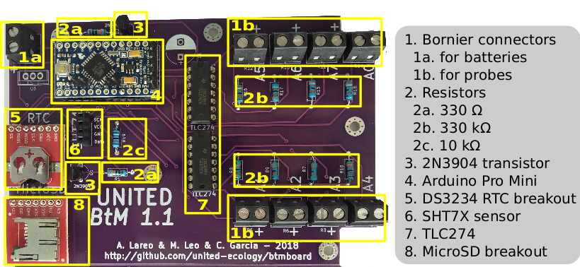
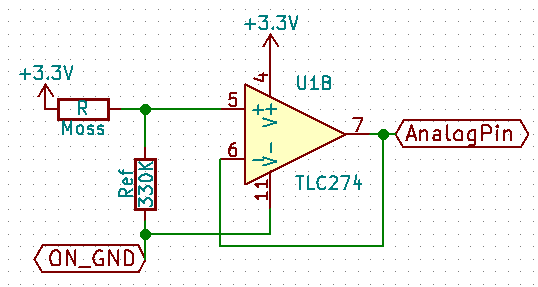

# BtM Board 1.2

This project is an Arduino based datalogger for monitoring moss conductance as well as environmental humidity and temperature. Up to eight moss and/or lichen samples can be logged in parallel using a single BtMboard. If you are interested in using it, do not hesitate to contact :)

This repository is associated with the following publication: Leo, M., Lareo, A., Garcia-Saura, C., Hortal, J., Medina, N. G. BtM, a Low-cost Open-source Datalogger to Estimate the Water Content of Nonvascular Cryptogams. *J. Vis. Exp.* (145), e58700, [doi:10.3791/58700](https://doi.org/10.3791/58700) (2019).

A video with further instructions on how to build and use the datalogger can be found in the paper link: [BtM, a Low-cost Open-source Datalogger to Estimate the Water Content of Nonvascular Cryptogams](https://www.jove.com/video/58700/btm-low-cost-open-source-datalogger-to-estimate-water-content). Notice that version 1.0 was used in the recording, and it might slightly differ from the current version.

Do not switch off the datalogger while measuring (LED light on). It can be switched off safely during the sleeping period (LED light off). 

## Sofware

This software folder contains the source code needed to use the BtM datalogger. Make sure you choose the appropriate board (Pro Mini 328 3.3V) in the Arduino IDE.

*Libraries* contains the libraries needed for the datalogger. Copy them to your local Arduino IDE installation in the `/libraries` folder. 

*Clock* contains a project to set up the date / hour of the BtM datalogger. It will set it according to your local system clock.

*Datalog* contains the main project used to log the data. The sampling frequency can be controlled here by modifying `interval` (sleeping period in seconds). Make sure you select the appropriate sensor (SHT7x / SHT85). See [this documentation](datalog-config.md) on how to do it.

## Hardware
The hardware folder contains the KiCAD project files for the BtM PCB Board. See the **List of Components** section for details about the hardware needed to assembly the board.

### Assembly schematic

### Obtaining measures

 As shown in the image, a voltage divider between each sample (Moss) and a resistor reference (Ref) with a known value (330KΩ in our case) is used to calculate the conductance measure. Probes are applied to each moss/lichen sample. Reference resistor value must be selected through calibration and based on previous measures of the cryptogams. It provides a resolution of one order of magnitude around the reference value (in our case, 100 – 1000 KΩ).

### List of Components
* BtMboard circuit (PCB)
* Arduino Pro Mini 328 3.3 V
* FTDI Basic Breakout
* MiniUSB to USB cable adapter
* TLC274 operational amplifier
* 2.54 mm breakout pin strip
* Resistors (8 x 330 Kohm, 2 x 330 Ohm, 1 x 10 KOhm)
* 2N3904 Transistor
* 9 x Bornier connectors, 2x1 5.08 mm
* Batteries and battery holder with switch
* Sensirion SHT7x / SHT85
* DS3234 RTC Breakout (clock)
* CR1225 3V Coin-cell battery
* MicroSD Transflash breakout

